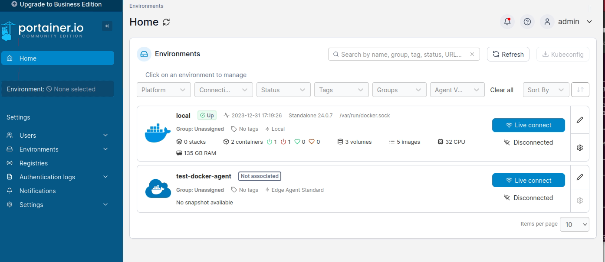
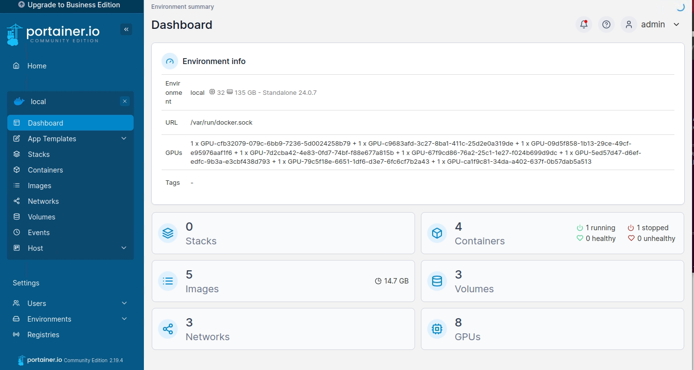
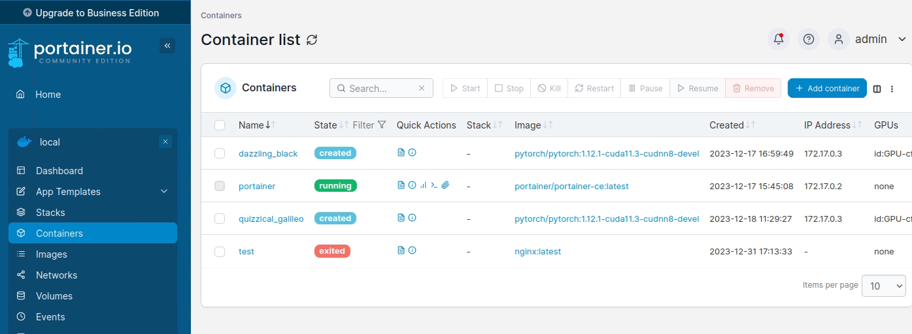
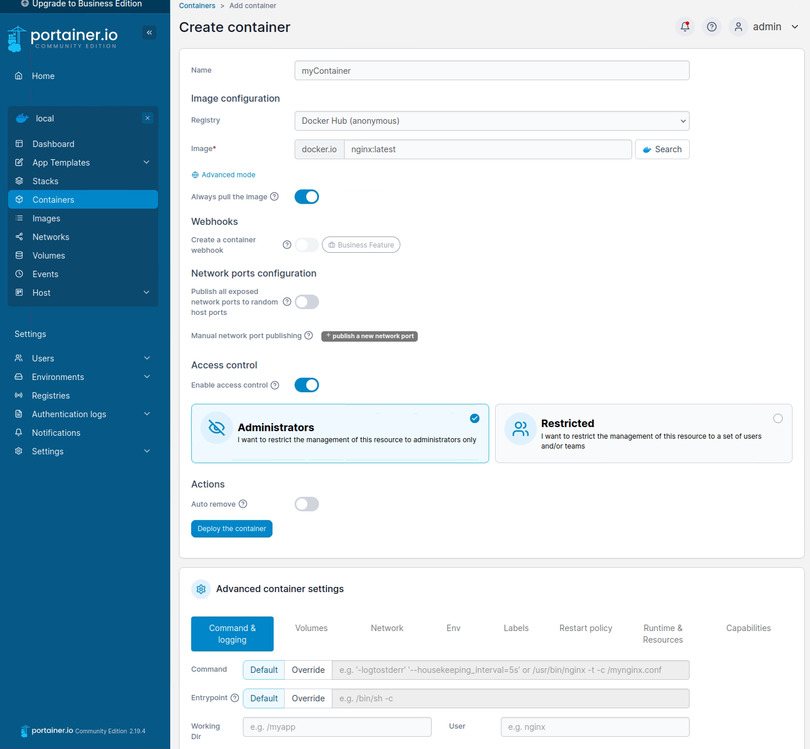

# Environment Installation

1. install nvidia driver 
```shell
sudo apt install nvidia-drivers-535 
```

2. install cuda 11.3
```shell
wget https://developer.download.nvidia.com/compute/cuda/11.3.0/local_installers/cuda_11.3.0_465.19.01_linux.run 
# omit the driver installation in this step 
sudo sh cuda_11.3.0_465.19.01_linux.run  
```

3. install anaconda
```shell
sudo mkdir /software 
# install anaconda dependencies
sudo apt-get install libgl1-mesa-glx libegl1-mesa libxrandr2 libxrandr2 libxss1 libxcursor1 libxcomposite1 libasound2 libxi6 libxtst6 
curl -O https://repo.anaconda.com/archive/Anaconda3-2023.09-0-Linux-x86_64.sh
# change the installation location to /software/anaconda3 at this step
bash ~/Downloads/Anaconda3-2020.05-Linux-x86_64.sh
# init conda
bash /software/anaconda3/bin/conda init
```

4. create global environment variables and settings for all users.
See `cuda.sh` and `anaconda3.sh` in `/etc/profile.d`.
conda config file is located at `/etc/conda/.condarc`

5. create virtual environment with anaconda
In this step, a virtual environmnet `cosense3d` is created, packages are installed locally in the venv except the following dependencies are installed globally with apt.
```shell
sudo apt install build-essential python3-dev libopenblas-dev -y
```

6. install docker
```shell
# Add Docker's official GPG key:
sudo apt-get update
sudo apt-get install ca-certificates curl gnupg
sudo install -m 0755 -d /etc/apt/keyrings
curl -fsSL https://download.docker.com/linux/ubuntu/gpg | sudo gpg --dearmor -o /etc/apt/keyrings/docker.gpg
sudo chmod a+r /etc/apt/keyrings/docker.gpg

# Add the repository to Apt sources:
echo \
  "deb [arch=$(dpkg --print-architecture) signed-by=/etc/apt/keyrings/docker.gpg] https://download.docker.com/linux/ubuntu \
  $(. /etc/os-release && echo "$VERSION_CODENAME") stable" | \
  sudo tee /etc/apt/sources.list.d/docker.list > /dev/null
sudo apt-get update
# add user to docker group
sudo usermod -aG docker $USER
```

7. install portainer
```shell
# create the volume that Portainer Server will use to store its database
docker volume create portainer_data
# download and install the Portainer Server container
docker run -d -p 8000:8000 -p 9443:9443 --name portainer --restart=always \
-v /var/run/docker.sock:/var/run/docker.sock \
-v portainer_data:/data portainer/portainer-ce:latest

```

8. Problems:

## Cheatsheet
### Access the server
Our IKG GPU server is physically running at LUIS, the access IP is `130.75.51.22`.
You can either access with `ssh USERNSME@130.75.51.22` or __portainer__ with your web browser `https://130.75.51.22:9443`.
Please contact the Administrator for accounts.

### How to manage your data?
A filesystem is permanently mounted at mounting point `/koko` of the server system.
This folder is set with all permissions (rwx) for all users.
If you want access this filesystem, please create a folder with ***you own name*** 
and take care that you don't modify the folders and contents of other users.

### Configure the environment with Anaconda.
Currently, portainer can only successfully deploy containers without GPU access, 
if you want to use GPUs, please use Anaconda to configure your environment. 
Our Server is now installed `Ubuntu 20.04.6 LTS (Focal Fossa)`, `nvidia-driver-535` and `CUDA=11.3`. If you want to user other CUDA versions, 
please contact the administrator or the maintainer.
The following script is a simple example for configuring a conda environment for training a deep learning model.
Please check the *installation manual of your goal project* and the *Anaconda official documentation* for more details.
If you want to install some standard packages to the server base system with `apt`, please contact the administrator for support.
```shell
# copy your code and data the the folder /koko/USERNAME
cd /koko/USERNAME/Project
# create a virtual environment with conda
conda create -n testenv python=3.8
conda activate testenv
# install python packages with conda
# i.e.
pip install -r requirement.txt
...
# go to your project folder and start training
PYTHONPATH=. python train.py
```

### Setup the environment with Portainer
1. Log in to the service with your username and password. You will see a list of available local base environment.
Click `Live connect` to connect to a specific environment.

2. After environment connection, you will see the dashboard of this environment. Click the `Container` in the menu column on the left.

3. At the container paper, you can control your containers. Use the blue button `Add contianer` to add a new container.

4. An example of deploying a container with the image pulled from docker hub.


For more details, please check the official [documentation of portainer](https://docs.portainer.io/).